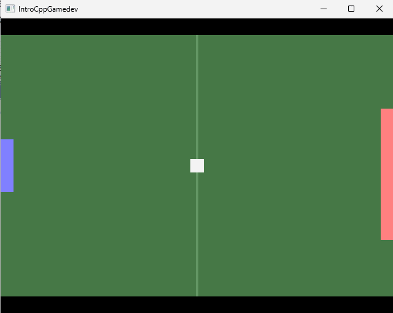

# IntroCppGamedev

Base de code pour le cours d'introduction au C++ pour le développement de jeux vidéo.

Cours par Julien Vernay. Pour me contacter : `edu@jvernay.fr`

## Mise en place

Avant toute chose, écrivez un message dans ce fil de discussion : [https://github.com/J-Vernay/IntroCppGamedev/issues/1](https://github.com/J-Vernay/IntroCppGamedev/issues/1)

1. Ouvrir Visual Studio 2022
2. Cliquer sur "Cloner un dépôt"
  - Emplacement du dépôt : `git@github.com:J-Vernay/IntroCppGamedev.git`
  - Chemin : Parcourir -> Bureau -> Nouveau dossier - > `IntroCppGamedev`
3. Appuyer sur "Cloner"
4. Dans la fenêtre de droite "Modifications Git" :
  - Cliquer sur "main"
  - Cliquer sur "Nouvelle branche"
	- Spécifier "NOM_Prenom" comme nom de branche
	- Vérifier que "Checkout la branche" est cochée
  - Cliquer sur "Create"
5. Dans la fenêtre "Explorateur de solutions" à droite :
  - Clic-droit sur "Exo1"
  - Cliquer sur "Définir en tant que projet de démarrage"
6. Dans la barre d'outils en haut :
  - Cliquer sur la flèche verte "Débogueur Windows local"

Vous devriez obtenir cette fenêtre :

Une fois ceci vérifié, c'est bon, l'environnement de développement est opérationnel ! 😎

11. Dans la fenêtre "Explorateur de solutions" à droite :
  - Déplier `Documentation`
  - Déplier `docs`
  - Déplier `cours`

Vous aurez alors accès à la documentation du cours.
Notamment, les fichiers `exoN.md` correspondent aux sujets de TDs à faire en cours.
Ces fichiers contiennent des questions auxquelles il faut répondre en modifiant directement le fichier.
Commencez en ouvrant `exo1.md`.

## Merge

1. Assurez-vous de n'avoir aucune modification locale non-commit (faire un commit si besoin).
1. Dans la barre de menu en haut de Visual Studio 2022, dans "Git", cliquer sur "Manage Branches".
2. Double-cliquer sur la branche "main".
2. Faire clic-droit sur la branche "main" puis cliquer sur "Pull".
3. Double-cliquer sur la branche "NOM_Prenom"
4. Faire clic-droit sur la branche "main" puis cliquer sur "Merge 'main' into 'NOM_Prenom'"
5. Cliquer sur "Merge"
6. Si tout se passe bien, vous devriez avoir le fichier "Documentation > docs > cours > dino.md"