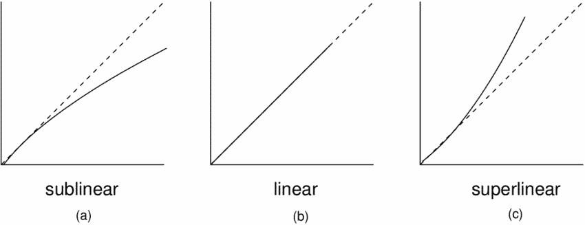

# Aide à l'analyse de données

Dans un graphe 2D, en particulier ceux générés avec [CSVPlot](https://www.csvplot.com/),
on regarde l'évolution d'une variable en ordonnée (= axe Y)
par rapport à une variable en abscisse (= axe X).

## Classement des situations

Pour interpréter les graphes qui seront générés avec l'outil,
les situations peuvent être classées suivant trois catégories
d'évolution de la variable en ordonnée (axe Y) suivant la variable en abscisse (axe X).

a. Sous-linéaire : L'ordonnée évolue moins vite qu'une simple proportionnalité
    par rapport à l'abcisse ; son évolution "ralentit".  
b. Linéaire : L'ordonnée évolue en parfaite proportionnalité par rapport à l'abscisse.  
c. Sur-linéaire : L'ordonnée évolue plus vite qu'une simple proportionnalité
    par rapport à l'abcisse ; son évolution "accélère".

Pour ce faire, prenez la tendance décrite par les premiers points de la courbe (à gauche),
prolongez la droite, et regardez si les points suivant tombent en-dessous
de la droite prolongée (= sous-linéaire), sur la droite prolongée (= linéaire),
ou au-dessus de la droite prolongée (= sur-linéaire).

## Détermination d'un coefficient de proportionnalité

Si l'évolution est linéaire, et si la droite de tendance passe par l'origine (= le point (0,0)),
alors il est facile de déterminer un coefficient de proportionnalité.

Prenez un point de la courbe qui est représentatif de la tendance,
c'est-à-dire qu'il est sur la droite de tendance, et idéalement avec des valeurs assez grande (plutôt à droite).

Divisez sa coordonnée en ordonnée par sa coordonnée en abscisse,
cela donne une approximation du coefficient de proportionnalité R.

Si X est la variable d'abscisse et Y la variable d'ordonnée, alors cela s'interprète par
"Il y a [R] Y pour un X".