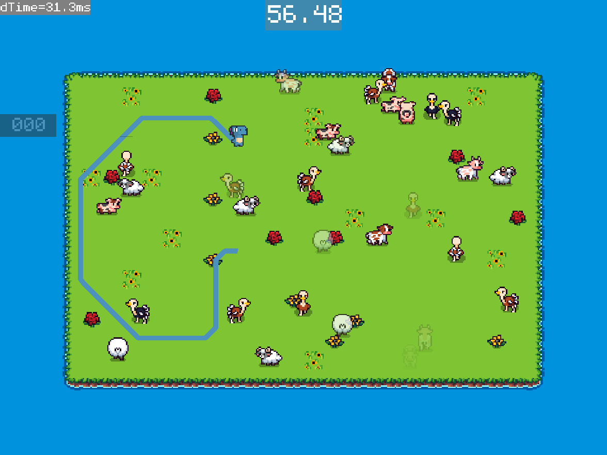

# Projet DinoRanch

A partir de maintenant, nous travaillerons sur un même projet : "DinoRanch".

DinoRanch est un projet de jeu 2D d'arcade de 1 à 4 joueurs en local.
Le jeu est en vue du dessus. Les joueurs incarnent chacun un dinosaure.
Les dinosaures doivent capturer des animaux en tournant autour.
Les animaux capturés donnent des points. Plus la prise est grosse, plus il y a de points.
La partie s'arrête quand le chronomètre arrive à sa fin, et les points sont décomptés.

## 1. Prise en main

Dans l'explorateur de solutions, à droite, clic-droit sur "Dino",
puis clic sur "Définir en tant que projet de démarrage / Set as Startup Project".

Compiler et lancer le projet ; vous devriez avoir des animaux qui apparaissent
et se déplacent vers l'extérieur de l'écran.

A) Dans l'explorateur de solutions, à droite, clic-droit sur "Documentation",
puis clic sur "Générer / Build". Ensuite, ouvrir l'explorateur de fichiers,
et ouvrir le fichier `docs/html/index.html` (avec un navigateur Internet).

B) Dans la documentation, dans l'onglet "Espace de nommage", cliquer sur "Liste des espaces de nommages".
Puis cliquer sur le namespace `dino`. Parcourir la page pour prendre connaissance de ce qui est déjà fourni.
Quelles classes sont déjà définies et que font-elles ?

> Animal : Gère chaque animal présent sur le terrain de jeu (Initialisation, Déplacement, Draw...)
>
> Scene : Gère la logique globale de scène (Appel logique des animaux, apparition de nouveaux animaux, affichage debug fps...)
>
> Terrain : Gère la logique liée au terrain de jeu (affichage du terrain, changment saison, séléction de position sur le terrain...)

C) Lancer le programme en configuration "Debug", attendre quelques secondes,
puis mettre un point d'arrêt (= breakpoint) à la fin de `jv::game::Draw()`
(sur la ligne de l'accolade fermante). Dans la fenêtre "Espion 1 / Watch 1",
regarder "g_rdr". Combien de vertex buffers y a-t-il, et de quels types ?
Combiend de textures y a-t-il, et de quels types ?

> Il y a 21 vertex buffers, 1 Terrain, 1 par animal et 1 pour le texte
>
> Il y a 56 textures, "white", "animals.bmp", "terrain.bmp" et "monogram-bitmap.bmp". A noter que le nombre de textures semble augmenter à fur et à mesure de la partie.

D) Dans `dino_animal.cpp`, que veut dire la syntaxe `dino::Animal::~Animal()` ?
Mettre un breakpoint dans cette fonction, puis une fois le programme en pause,
afficher la fenêtre "Pile d'appel / Callstack" en bas.
Qui appelle cette méthode ? Si besoin, clic-droit > "Show external code"

> `dino::Animal::~Animal()` est un destructeur de la class Animal, c'est un code qui est joué lors de la libération de la mémoire correspondant à l'objet.
>
> `std::destroy_at<dino::Animal>_` appelle cette méthode.

E) Dans `dino::Scene::_UpdateAnimals()`, dans la syntaxe `for (Animal& animal : m_animals)`,
enlever l'esperluette `&`. Quel impact cela a-t-il et pourquoi ?

> Cela crash le logiciel pour raison "Texture déjà détruite", car l'esperluette permet de passer par réference dans la for loop, et non pas une copie.

F) Comment prévenir cette erreur à la compilation ? Quelle bonne pratique est associée à cela ?

> ...

Remettre l'esperluette.

G) Comment faire pour qu'il n'y ait qu'une unique texture `animal.bmp` chargée en VRAM ?
Le faire.

> Il faut charger la texture une seule fois (par exemple à l'init du jeu), donner une référence globale à la texture et l'utiliser dans Animal::draw().

H) Dans `dino::Animal::Draw()`, à quoi servent les coordonnées `uv` des `jv::gpu::Vertex` ?

> Les coordonnées `uv` correspondent aux coordonées (en pixel) des vertex du sprite projeté sur la texture, cela sert à découper une seul texture en sous section pour afficher seulement la bonne partie.

I) Faire en sorte que les animaux aient la tête vers la droite quand ils se déplacent vers la droite,
en mettant leurs sprites en miroir.

J) Appliquer les animations de mouvement vers le haut et vers le bas quand les animaux
se déplacent principalement verticalement.
Pour modifier les coordonnées UV, se référer à [dino_uv_ref.md](dino_uv_ref.md)

## 2. Joueurs

A) Créer deux nouveaux fichiers sources `src/dino/dino_player.h` et `src/dino/dino_player.cpp`. 
Pour cela, suivez ce guide :

1. Clic-droit sur "Dino" depuis la fenêtre "Explorateur de solutions / Solution Explorer"
2. Clic sur "Ajouter / Add" puis "Nouvel élément / New element..."
3. Sélectionner "Fichier C++ (.cpp)" ou "Fichier d'en-tête (.h)"
4. Changer le nom du fichier en bas de la fenêtre
5. **IMPORTANT: Changer le chemin du fichier en cliquant sur "Parcourir / Browse" puis en
   sélectionnant `src/dino`. SINON VOTRE FICHIER NE SERA PAS SAUVEGARDE SUR GIT !**
6. Clic sur le bouton "Ajouter / Add"

Nous allons maintenant implémenter les joueurs.

B) Créer une classe `dino::Player` sur le même modèle que `dino::Animal` (copié-collé),
Instancier un `dino::Player` dans `dino::Scene`.

C) Modifier la méthode `dino::Player::Update()` pour que `m_dir` s'adapte
aux variables membres `dpad` du gamepad. Prendre en inspiration le code
de l'exercice 1 qui s'occupait de faire monter ou descendre le joueur.

D) Ajouter un bouton de sprint ; doubler la vitesse de déplacement
quand `btn_right` est appuyé (D sur le clavier).

E) Modifier la méthode `dino::Player::Draw()` pour afficher le sprite du joueur
dans la bonne direction et avec la bonne animation.
Là encore, se référer à [dino_uv_ref.md](dino_uv_ref.md)

F) Faire en sorte que lorsqu'on appuie sur le `btn_left` (Q sur le clavier),
le dinosaure se prend un dégât (= immobilisation 3 secondes + animation).

G) Modifier le code pour avoir 4 dinosaures affichés à l'écran,
déplaçable avec des périphériques différents (clavier, manette 1, manette 2, manette 3).

## 3. Physique du jeu

A) Implémenter : "Les dinosaures ne peuvent pas sortir des limites du terrain."

B) Implémenter : "Les animaux ne peuvent pas sortir des limites du terrain.
Quand ils atteignent le bord du terrain, ils prennent une nouvelle direction aléatoirement."

C) Comment détecter si deux cercles à des positions données sont en collision ?

> 2 cercles sont en collisions si la somme de leur rayon est plus petites (ou égale selon les implémentations) que la distance entre leurs origines.

D) Comment repousser deux cercles en collision de façon minimale et qu'il ne soient plus en collision ?
Quel cas particulier n'est pas résoluble ?

> Il faut repousser les cercles dans la direction opposée à la direction vers l'autre, la distance de repousse est égale à la différence entre la somme des rayons et la distance entre les origines, divisée par 2 (car les 2 cercles s'entre-repoussent).
>
> Cela n'est pas résoluble si les 2 cercles possèdent la même origine

E) Implémenter : "Quand les dinosaures sont en collision (distance < 16 pixels), ils se repoussent."

F) Implémenter : "Les animaux se repoussent entre eux, et aussi les animaux et les dinosaures entre eux."
Pourquoi y a-t-il duplication de code ?

> Car dino::Player et dino::Animal ont une fonctionnalité similaire (Vec2 m_pos et collision) mais le compilateur ne peut pas le savoir, il faut donc dupliquer le code pour gérer les 3 cas (Player<=>Player, Player<=>Animal, Animal<=>Animal)

G) Quelle fonctionnalité du C++ permet de dédupliquer la logique commune entre `dino::Player` et `dino::Animal` ?
L'appliquer dans la base de code.

> Il faut implémenter le principe d'héritage (une classe parent à `Player` et `Animal`).

H) Quelle fonctionnalité du C++ permet de gérer différemment un point de logique commune,
comme la réaction à un événement du type "limite du terrain" ? L'appliquer dans la base de code.

> Il faut utiliser le principe de redéfinition (*override*).

I) Quelles méthodes de classes pourraient être mises en commune suivant le même principe ?
L'appliquer dans la base de code.

> `Update` et `Draw`.

J) Implémenter : "Les dinosaures et les animaux sont affichés les uns derrière les autres, suivant leur position verticale."
Cela implique de trier un tableau qui peut contenir à la fois des DinoPlayer et des DinoAnimal. Comment faire ?

> Pour avoir un tableau contenant des `Player` et `Animal` il faut crée un tableau de pointeur de classe parent (ex: `std::vector<Entity*>`).

## 4. Programmation des lassos

A) Implémenter : "Des suites de points sont dessinées correspondant aux positions passées"
des dinosaures, aux couleurs des dinosaures.

B) Implémenter : "Les suites de points sont tronquées à une longueur maximale de deux secondes."
Quelle méthode de std::vector utiliser ?

> ‍`std::vector::erase`

C) Implémenter : "Quand deux segments se coupent et sont du même joueur, la boucle est retirée du lasso"
(mais la partie avant la boucle existe toujours). Combien d'intersections de segments sont calculés (en comptant les 4 joueurs) ?

> ...

D) Implémenter : "Quand un joueur passe par dessus le lasso d'un autre joueur, le début du lasso est détruit jusqu'à l'intersection."
Faire en sorte que les instances de la classe DinoPlayer n'ont pas besoin d' interagir entre elles.

E) Comment détecter qu'une position est à l'intérieur d'un contour fermé définis par des segments ?

> ...

F) Implémenter via une logique commune, comme mentionné dans (3.H) : 
- Quand un dinosaure est dans une boucle de lasso, il se prend des dégâts (= immobilisation 3 secondes + animation).
- Quand des animaux sont dans une boucle de lasso, ils disparaissent.

**Fin de la partie dirigée du projet, continuer en autonomie sur `dino_cahier_des_charges.md`**

