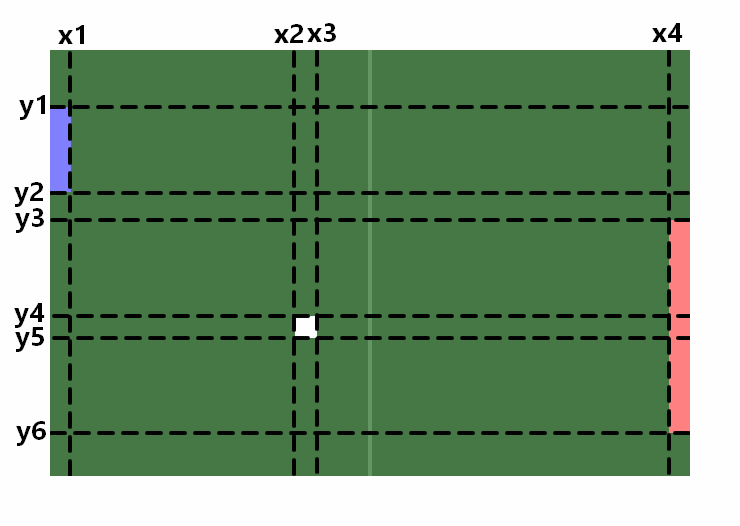

# Exercice 1

**OBJECTIF**  
Se familiariser avec :
- L'organisation de la base de code
- La syntaxe du C++
- Le mini-moteur de jeu "JV" qui sera utilisé pendant tout le cours
- Les quelques mathématiques nécessaires pour suivre le cours

Dans l'explorateur de solutions, à droite, clic-droit sur "Exo 1",
puis clic sur "Définir en tant que projet de démarrage".

## TD

Vous devez compléter ce fichier au fur et à mesure du cours.

A) Résumez en une phrase le rôle des fichiers suivants :

> `jv.h` : 
C'est l'API globale de ce petit moteur de jeu. Elle sert d'interface definissant le contrat d'un jeu sur ce moteur.

> `jv_win64_impl.h` :
C'est l'API interne d'implémentation du moteur pour la plateforme Win64.

> `jv_win64_main.cpp` : 
Il contient de point d'entrée de l'application (pour Win64) et la boucle principale de jeu. Il fait le pont entre l'OS et le jeu.

> `jv_win64_window.cpp` : 
Il implémente le cycle de vie de la fenetre de l'application sous Windows.

> `jv_win64_renderer.cpp` :
Il implémente le systeme de rendu graphique du moteur en utilisant une API graphique (DirectX). Il fait le lien entre l'application et le GPU.

> `jv_win64_file.cpp` : 
Il implémente le chargement dans la RAM des assets contenus sur le disque, grace à l'API native de Windows.

> `exo1_pong.cpp` : 
Il implémente la logique d'un jeu de Pong et remplit le contrat de jv::game.

B) Remettez les commentaires ci-dessous aux bons endroits,
dans les fichiers `jv_win64_main.cpp` et `jv_win64_window.cpp`:

C) Quelles sont les 4 fonctions qu'un jeu doit fournir au moteur de jeu JV ?

> Le contrat jv::game contraint à définir Init(), Update(), Draw() et Shut()

D) Dans la fonction DrawRect(), que représente 'pos' et 'size' ?

> pos représente la position du coin supérieur gauche du rectangle et size représente ses dimensions(largeur, hauteur).
La fonction utilise ces informations pour connaitre la position du premier point (vertex) et placer les suivants par rapport aux dimensions.

E) Qu'est-ce qu'un Vertex ? Que fait `jv::gpu::CreateVertexBuffer()` ?
Que fait `jv::gpu::Draw()` ?

> Un Vertex désigne un sommet d'une géométrie en rendu graphique. 
"jv::gpu::CreateVertexBuffer()" sert à récuperer des struct Vertex de la RAM pour les envoyer à la VRAM sous la forme d'un Vertex Buffer.
L'espace mémoire Vertex Buffer sur la VRAM est optimisé pour le rendu de géométrie.
"jv::gpu::Draw()" est l'implémentation du DrawCall. À chaque fois que cette fonction est effectuée, le GPU rend la géométrie du Vertex Buffer.

F) La balle se dirige vers la droite, à une vitesse de 300 pixels par seconde.
Le temps entre deux frames est 20 millisecondes. Quelle distance en pixel a été parcourue entre ces deux frames ?

> V = d/t
300 pix/s = d/0,02s
d = 300 * 0,02 = 6
La distance parcourue est de 6 pixels.

G) Le temps entre deux frames est 10 millisecondes. Pendant ce temps, la balle s'est dirigée
suivant le vecteur (-30, 40) (en pixels). Dans quelle direction s'est-elle déplacée ?
À quelle vitesse, en pixels par seconde, cela correspond-il ?

> Selon le repére utilisé (x croissant vers la droite et y croissant vers le bas), la balle se déplace en diagonale vers le bas à gauche.

On calcul la distance parcourue avec le théoreme de Pythagore :
distance = sqrt((-30)au carré + 40 au carré)
distance = 50 pixels

V = 50pix / 0,01s = 5000pix/s

H) La balle est à la position (100, 200). Elle se dirige en diagonale droite-haut,
à la vitesse de 100 pixels par seconde. À quelle position la balle est-elle au bout d'une seconde ?

> On considére une diagonale droite-haut de 100pix distDiagonale. On cherche le déplacement en X et Y (distX et distY).
Si on considére un triangle rectangle à partir du repére distX, distY dont l'hypothénuse est distDiagonale.

D'après le théorème de Pythagore:
distX carré + distY carré = distDiagonale carré = 100 au carré

C'est une diagonale parfaite donc la distance horizontale et verticale parcourue est la meme. distX = distY donc,
distX carré + distX carré = 100 au carré
2distX carré = 10000
distX carré = 5000
distX = sqrt(5000) ≈ 70,7

On ajoute ce déplacement aux coordonnées de départ (en prenant compte de l'axe Y inversé par rapport à un repére orthonormé).
nouvelle position ≈ (171, 129)

I) Modifier le code pour que la balle se déplace, dépendamment de sa vitesse, de sa direction, et du temps écoulé.

J) D'après l'image ci-dessous, exprimez les coordonnées suivantes suivant les variables du code C++ :

> `x1 = kPlayerSize.x`
>
> `x2 = g_ballPos.x`
>
> `x3 = g_ballPos.x + kBallSize.x`
> 
> `x4 = karenaSize.x - kAiSize.x`
>
> `y1 = g_playerPos.y`
>
> `y2 = g_playerPos.y + kPlayerSize.y`
>
> `y3 = g_aiPos.y`
>
> `y4 = g_ballPos.y`
>
> `y5 = g_ballPos.y + kBallSize.y`
>
> `y6 = g_aiPos.y + kAiSize.y`

K) Implémenter les conditions de détections de collisions.

L) Implémenter les conditions de victoire du joueur et de l'IA.

**Prochain exercice : exo2.md**
