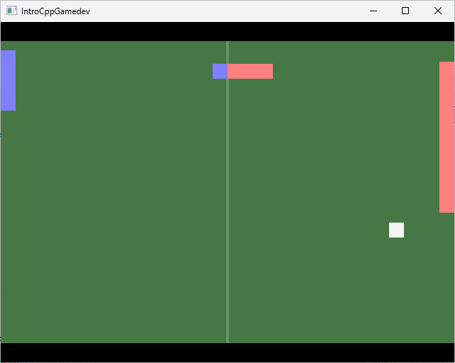

# Exercice 2

**OBJECTIF**  
- Comprendre le découpage en plusieurs fichiers en C++.
- Première découverte de la programmation orientée objet (POO) en C++.

**RESSOURCES**
- [Cours sur la POO en C++)](https://zestedesavoir.com/tutoriels/822/la-programmation-en-c-moderne/la-programmation-orientee-objet/)

## TD

Dans ce TD, nous allons adapter le code de Pong de l'exercice 1 sous forme
de programmation orientée objet.

Dans l'explorateur de solutions, à droite, clic-droit sur "Exo 2",
puis clic sur "Définir en tant que projet de démarrage".

A) Prendre connaissance des fichiers fournis et exécutez le programme.
Vous devriez voir une fenêtre qui change de couleur.

B) Assembler le vocabulaire de POO avec leurs définitions
et les exemples dans le code :

> VOCABULAIRE :
> a) Classe
> b) Méthode
> c) Attribut
> d) Instance
> e) Constructeur
> 
> DEFINITIONS :
> 1. Fonction membre responsable d'initialiser l'état
> 2. Type encapsulant un comportement et l'état nécessaire à ce comportement
> 3. Zone mémoire allouée pour stocker l'état d'une classe
> 4. Fonction membre qui peut accéder implicitement à l'état d'une classe
> 5. Variable membre faisant partie de l'état d'une classe
> 
> EXEMPLES :
> I. `Pong::m_color`
> II. `Pong::Update`
> III. `g_Pong`
> IV. `Pong`
> V. `Pong::Pong`
> 
> Classe | Type encapsulant un comportement et l'état nécessaire à ce comportement | `Pong`
> Méthode | Fonction membre qui peut accéder implicitement à l'état d'une classe | `Pong::Update`
> Attribut | Variable membre faisant partie de l'état d'une classe | `Pong::m_color`
> Instance | Zone mémoire allouée pour stocker l'état d'une classe | `g_Pong`
> Constructeur | Fonction membre responsable d'initialiser l'état | `Pong::Pong`

C) Changer le code de `Pong::Draw()` pour modifier `m_color`.
Pourquoi le compilateur émet une erreur ?
Pourquoi cette fonctionnalité du C++ est désirable ?

> Le compilateur émet une erreur car la fonction "Draw" est static, elle ne peut pas accéder à un attribut de classe car elle n'est pas jouer dans le contexte d'une instance.
> 
> Cette fonctionnalité permet de jouer une fonction sans avoir besoin d'une instance.

D) Appeler la fonction `exo2::DrawRect()` depuis la fonction `Pong::Draw()`.
Pourquoi le compilateur émet une erreur ?
Qu'est-ce qu'il manque ?

> Le compilateur émet une erreur car la fonction n'est pas implémenter
>
> Il manque une implémentation de la fonction exo2::DrawRect() dans exo2_draw.cpp.

E) Modifier `exo2_draw.cpp` pour que cela fonctionne.

F) Migrer le code de l'exercice 1 `exo1_main.cpp` vers l'exercice 2 dans `exo2_pong.cpp`.

G) Découper `Pong::Update()` en trois sous-fonctions :
`_UpdateAI()`, `_UpdatePlayer()` et `_UpdateBall()`.

H) À quoi servent les modificateurs d'accès `public` et `private` ?

> Les modificateurs public et private permettent d'autoriser ou non l'appel d'une fonction d'une classe depuis l'extérieur de la classe.

I) Définissez les termes suivants :

> Encapsulation : L'encapsulation correspond à la limitation d'accès aux méthodes et attributs d'une classe.
>
> Invariant d'une classe : ...

J) Implémentez la fonction `exo2::DrawScore()` dans `exo2_draw.cpp`,
puis servez-vous en pour afficher le score du joueur et de l'IA.
Par exemple, sur l'image ci-dessous, le score est de 1-3 en faveur de l'IA.

**Prochain exercice : exo3.md**
